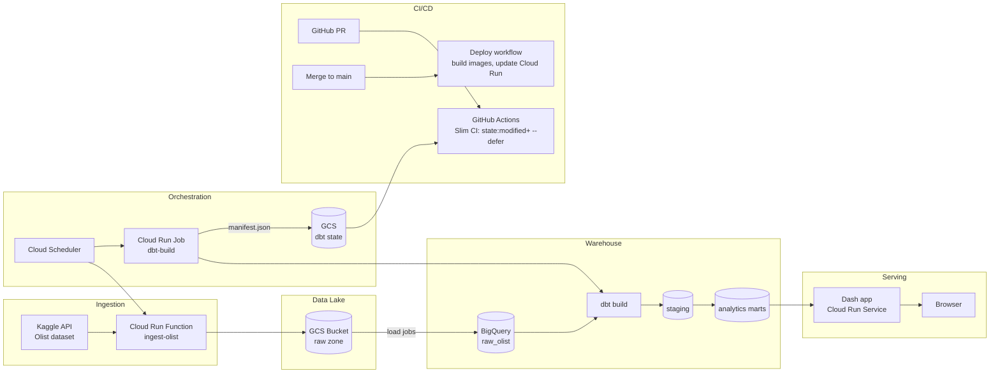

# PROJECT.md — End-to-End Analytics Project: Olist E-commerce on GCP with dbt

> **Purpose:** Build a fully functional, production-grade, end-to-end analytics platform on the Olist Brazilian E-commerce dataset — from raw data ingestion to a hosted dashboard — while exercising **every topic in the dbt Analytics Engineering Certification study guide (v1.11)** hands-on. Completing every phase of this project (and its acceptance criteria) is your preparation path to the exam.
>
> **Companion documents:** [TUTORIAL.md](TUTORIAL.md) — open it whenever you get stuck; every phase below links to the matching tutorial section. [dbt_Study_Guide_AI_Knowledge_Base.md](dbt_Study_Guide_AI_Knowledge_Base.md) — the official study guide content (topics outline, logistics, 10 worked sample questions) in searchable form.

---

## Table of Contents

1. [Final Objective & Success Criteria](#1-final-objective--success-criteria)
2. [Architecture](#2-architecture)
3. [Tech Stack & Versions](#3-tech-stack--versions)
4. [Repository Layout](#4-repository-layout)
5. [The Dataset](#5-the-dataset)
6. [Phase 0 — Foundations (GCP + GitHub setup)](#phase-0--foundations)
7. [Phase 1 — Ingestion: Cloud Run Function → GCS Data Lake](#phase-1--ingestion)
8. [Phase 2 — Data Lake → BigQuery Raw Layer](#phase-2--data-lake--bigquery-raw-layer)
9. [Phase 3 — The dbt Project (Core of the Certification Prep)](#phase-3--the-dbt-project)
10. [Phase 4 — Production dbt: Cloud Run Job](#phase-4--production-dbt-cloud-run-job)
11. [Phase 5 — CI/CD with GitHub Actions](#phase-5--cicd-with-github-actions)
12. [Phase 6 — Dash Dashboard on Cloud Run](#phase-6--dash-dashboard-on-cloud-run)
13. [Phase 7 — dbt Platform (dbt Cloud) Study Track](#phase-7--dbt-platform-study-track)
14. [Certification Traceability Matrix](#8-certification-traceability-matrix)
15. [Suggested Timeline](#9-suggested-timeline)
16. [Definition of Done](#10-definition-of-done)

---

## 1. Final Objective & Success Criteria

**Objective:** A live, end-to-end analytics platform where:

1. A **Cloud Run function** ingests the Olist dataset into **Google Cloud Storage** (the data lake) on a schedule.
2. Raw data is loaded into **BigQuery** (the data warehouse).
3. A **dbt** project transforms raw data into tested, documented, governed marts — developed locally, executed in production by a **Cloud Run job**.
4. A **Dash** dashboard, deployed as a **Cloud Run service**, visualizes the marts.
5. **GitHub Actions** provides Slim CI on pull requests (state-based selection + deferral) and automated deployment on merge.

**Success = all of the following:**

- [ ] Every phase's acceptance criteria checked off.
- [ ] Every row of the [Certification Traceability Matrix](#8-certification-traceability-matrix) marked "practiced".
- [ ] The dashboard is reachable at a public URL and shows data produced by the nightly dbt build.
- [ ] You can explain and demonstrate every dbt concept in the matrix without looking it up.

---

## 2. Architecture



**Environment strategy (BigQuery datasets):**

| Environment | Dataset(s) | Who writes | Purpose |
|---|---|---|---|
| Raw | `raw_olist` | Ingestion pipeline only | Untransformed landing tables |
| Dev | `dbt_pjaramillo` (+ custom-schema suffixes) | You, from your laptop | Personal dev sandbox |
| CI | `dbt_ci_pr_<number>` | GitHub Actions | Ephemeral per-PR builds, dropped after merge |
| Prod | `analytics` → `analytics_staging`, `analytics_marts`, `analytics_snapshots` | Cloud Run job only | What the dashboard reads |

---

## 3. Tech Stack & Versions

| Layer | Technology | Notes |
|---|---|---|
| Language | Python 3.13 locally (3.12 on Cloud Run runtimes) | Project venv: `.venv/` in the repo root |
| Ingestion | Cloud Run **function** (2nd gen), `functions-framework`, `kaggle`, `google-cloud-storage` | HTTP-triggered, called by Cloud Scheduler |
| Data lake | Google Cloud Storage | Single bucket, zoned prefixes |
| Warehouse | Google BigQuery | On-demand pricing, `US` (or your preferred) location — pick ONE location and never mix |
| Transformation | **dbt Core ≥ 1.10** + `dbt-bigquery` adapter | The heart of the project |
| dbt packages | `dbt_utils`, `dbt_expectations`, `codegen` | Installed via `packages.yml` |
| Prod dbt runtime | Docker + Artifact Registry + Cloud Run **job** | Runs `dbt build`, uploads artifacts |
| Scheduling | Cloud Scheduler | Cron triggers for ingestion + dbt job |
| CI/CD | GitHub Actions + Workload Identity Federation | Keyless GCP auth |
| Dashboard | Dash (Plotly) + gunicorn, Cloud Run **service** | Reads marts only |
| Secrets | Secret Manager | Kaggle credentials |
| Cert study track | dbt platform free Developer account | Phase 7 |

---

## 4. Repository Layout

Target structure of this repo when finished:

```
├── PROJECT.md
├── TUTORIAL.md
├── README.md
├── .gitignore
├── ingestion/                  # Phase 1
│   ├── main.py
│   ├── requirements.txt
│   └── tests/
├── warehouse/                  # Phase 2
│   └── load_raw.py             # GCS -> BigQuery load logic (or part of ingestion)
├── dbt/                        # Phase 3 — the dbt project
│   ├── dbt_project.yml
│   ├── packages.yml
│   ├── profiles/profiles.yml   # committed, uses env vars (no secrets)
│   ├── selectors.yml
│   ├── models/
│   │   ├── staging/
│   │   ├── intermediate/
│   │   └── marts/
│   ├── snapshots/
│   ├── seeds/
│   ├── macros/
│   ├── tests/                  # singular tests
│   └── analyses/
├── dbt_runner/                 # Phase 4
│   ├── Dockerfile
│   └── entrypoint.sh
├── dashboard/                  # Phase 6
│   ├── app.py
│   ├── pages/
│   ├── requirements.txt
│   └── Dockerfile
└── .github/workflows/          # Phase 5
    ├── ci_dbt.yml
    ├── deploy_dbt_job.yml
    └── deploy_dashboard.yml
```

---

## 5. The Dataset

**Olist Brazilian E-commerce Public Dataset** (Kaggle: `olistbr/brazilian-ecommerce`) — ~100k orders from 2016–2018 across 9 CSVs:

| File | Grain | Key columns |
|---|---|---|
| `olist_orders_dataset.csv` | 1 row per order | `order_id`, `customer_id`, `order_status`, timestamps |
| `olist_order_items_dataset.csv` | 1 row per item in an order | `order_id`, `order_item_id`, `product_id`, `seller_id`, `price`, `freight_value` |
| `olist_order_payments_dataset.csv` | 1 row per payment per order | `order_id`, `payment_type`, `payment_installments`, `payment_value` |
| `olist_order_reviews_dataset.csv` | 1 row per review | `review_id`, `order_id`, `review_score` |
| `olist_customers_dataset.csv` | 1 row per customer per order | `customer_id`, `customer_unique_id`, `customer_state` |
| `olist_sellers_dataset.csv` | 1 row per seller | `seller_id`, `seller_state` |
| `olist_products_dataset.csv` | 1 row per product | `product_id`, `product_category_name`, dimensions |
| `olist_geolocation_dataset.csv` | many rows per zip prefix | lat/lng by zip code prefix |
| `product_category_name_translation.csv` | 1 row per category | Portuguese → English category names |

**Known data quirks you will exploit for testing/debugging practice:** duplicate review IDs, orders without reviews, `customer_id` vs `customer_unique_id` (one-order-per-customer_id design), unavailable/canceled orders, missing product categories, geolocation duplicates. These are *features* for this project — they give your dbt tests something real to catch.

---

## Phase 0 — Foundations

**Goal:** A working GCP project, local toolchain, and GitHub repo with guardrails, so every later phase is friction-free.
**Tutorial:** [TUTORIAL.md §1 — Environment & GCP Setup](TUTORIAL.md#1-environment--gcp-setup)

### Requirements

1. **GCP project (from zero):**
   - Create a personal Google Cloud account (new accounts get $300 free credit) and a project, e.g. `olist-analytics-<suffix>`.
   - Attach billing. Immediately create a **budget with alerts** at 25/50/75/100% of a small amount (e.g. $10/month). This project should cost near-zero if built correctly.
   - Enable APIs: Cloud Run, Cloud Storage, BigQuery, Artifact Registry, Cloud Scheduler, Cloud Build, Secret Manager, IAM Credentials.
2. **Service accounts (least privilege):**
   - `sa-ingestion` — writes to GCS, reads Secret Manager, loads to BigQuery raw.
   - `sa-dbt-runner` — BigQuery job user + data editor on dbt datasets, reads/writes the dbt-state GCS prefix.
   - `sa-dashboard` — BigQuery read-only on `analytics_marts` only.
   - `sa-github-actions` — used via Workload Identity Federation (Phase 5); deploy + BigQuery permissions for CI datasets.
3. **Local toolchain:** `gcloud` CLI installed and authenticated (`gcloud init`, `gcloud auth application-default login`), Docker Desktop, Python 3.12 venv for this repo, `dbt-bigquery` installed.
4. **GitHub repo:** push this repo to GitHub; protect `main` (require PR + passing checks). All later work happens in feature branches — this itself is exam material (*promoting code through version control*).
5. **Cost guardrails:** BigQuery custom quota or at minimum know your on-demand free tier (1 TB query/mo, 10 GB storage free); GCS lifecycle rule to delete objects under `raw/` older than 60 days; Cloud Run scale-to-zero everywhere; a written teardown checklist in README.

### Acceptance criteria

- [ ] `gcloud config list` shows the right project; `bq ls` and `gsutil ls` work.
- [ ] Budget alert email received (test with a $0.01 threshold, then set the real one).
- [ ] Repo on GitHub with branch protection on `main`.
- [ ] `dbt --version` works inside the venv.

---

## Phase 1 — Ingestion

**Goal:** A Cloud Run function that downloads the Olist dataset from Kaggle and lands it in the GCS data lake, idempotently, on a schedule.
**Tutorial:** [TUTORIAL.md §2 — Ingestion](TUTORIAL.md#2-ingestion-cloud-run-function--gcs)

### Requirements

1. **Bucket layout (data lake zones):**
   ```
   gs://<project>-datalake/
     raw/olist/<table_name>/ingestion_date=YYYY-MM-DD/<table_name>.csv
     dbt-state/prod/          # Phase 4 artifacts land here
   ```
2. **Cloud Run function `ingest-olist`** (Python 3.12, HTTP trigger):
   - Fetches the Kaggle API token from **Secret Manager** and exposes it as `KAGGLE_API_TOKEN` (never bake the token into the image or repo; the old `kaggle.json` flow is legacy).
   - Downloads and unzips `olistbr/brazilian-ecommerce`.
   - Uploads each of the 9 CSVs to the dated raw path.
   - **Idempotent:** re-running on the same day overwrites the same partition; no duplicate-day data.
   - Returns a JSON summary `{table: rows_uploaded}` and logs structured messages.
3. **Cloud Scheduler** job triggers the function weekly (the dataset is static — the schedule exists to practice orchestration; note this in the README).
4. **Local dev path:** the same `main.py` runnable locally with `functions-framework --target=ingest`.

### Acceptance criteria

- [ ] `curl` (authenticated) to the function URL completes and all 9 CSVs appear under today's `ingestion_date=` prefix.
- [ ] Second invocation the same day does not duplicate data.
- [ ] Scheduler trigger succeeds (check Cloud Run logs).
- [ ] No secrets in the repo or the container image.

---

## Phase 2 — Data Lake → BigQuery Raw Layer

**Goal:** Raw Olist tables queryable in BigQuery, forming dbt's *sources*.
**Tutorial:** [TUTORIAL.md §3 — BigQuery Raw Layer](TUTORIAL.md#3-bigquery-raw-layer)

### Requirements

1. Create dataset `raw_olist` (same location as everything else) with labels (`env=raw`, `owner=pjaramillo`).
2. Extend the ingestion function (or add a small `load_raw.py` step) to run **BigQuery load jobs** from the latest GCS partition into `raw_olist.<table_name>`, using `WRITE_TRUNCATE`, autodetected-then-pinned schemas, and an added `_loaded_at TIMESTAMP` column (you'll use this for **source freshness** in Phase 3).
3. Every raw table keeps original column names — transformation belongs to dbt, not the loader (ELT, not ETL).
4. *(Stretch)* Also expose one table as an **external/BigLake table** over GCS and compare trade-offs in the README.
5. Create the empty datasets for later phases: `analytics`, `dbt_pjaramillo` (dbt will create schemas within, but having explicit datasets makes IAM cleaner).

### Acceptance criteria

- [ ] All 9 tables in `raw_olist`, row counts match the CSVs (orders ≈ 99,441).
- [ ] Each table has a populated `_loaded_at` column.
- [ ] `sa-dashboard` cannot query `raw_olist` (test it: least privilege verified).

---

## Phase 3 — The dbt Project

**Goal:** The certification core. A complete dbt project on BigQuery exercising **all** modeling, testing, documentation, governance, debugging, and state topics. Budget ~60% of total project time here.
**Tutorial:** [TUTORIAL.md §4 — dbt](TUTORIAL.md#4-dbt--concepts-cheat-sheets-and-how-tos) (cheat sheets) and [TUTORIAL.md §8 — Troubleshooting](TUTORIAL.md#8-troubleshooting-by-symptom)

This phase is split into 10 workstreams (3.1–3.10). Do them roughly in order; each maps to study-guide topics (noted as **[Cert: …]**).

### 3.1 Project scaffolding & configuration **[Cert: Topic 1 — dbt_project.yml, project structure]**

- `dbt init` a project under `dbt/`; connect to BigQuery via `profiles.yml` with **two targets**:
  - `dev` → dataset `dbt_pjaramillo`, oauth (your ADC), threads 4
  - `prod` → dataset `analytics`, service-account impersonation/keyfile via env var, threads 8
- Configure in `dbt_project.yml` (learn the **config precedence hierarchy**: model config block > folder config in `dbt_project.yml` > project default):
  - `staging/` defaults to `materialized: view`, `marts/` to `materialized: table`
  - Folder-level `+tags` (e.g. `staging`, `marts`, `finance`)
  - Project-level `on-run-end` hook that logs run results (simple macro)
- Write a **style guide** section in the README: naming (`stg_`, `int_`, `fct_`, `dim_`), one model per file, CTE conventions (import CTEs → logical CTEs → final select).

### 3.2 Sources & staging **[Cert: Topic 1 — sources; Topic 7 — source freshness]**

- `models/staging/olist/_olist__sources.yml`: declare all 9 `raw_olist` tables as a **source** named `olist`, with:
  - `loaded_at_field: _loaded_at` and **freshness** config (`warn_after: 8 days`, `error_after: 15 days` — tuned to the weekly ingestion)
  - source- and table-level descriptions
  - source tests (e.g. `unique` on raw primary keys — some will FAIL by design, e.g. reviews; capture what you learn)
- One **staging model per source table** (`stg_olist__orders.sql`, etc.): rename to snake_case English, cast types, convert timestamps, no joins, no aggregation. Use `codegen` package to generate boilerplate.
- Use `{{ source() }}` everywhere — zero hardcoded table names from here on. **[Cert: identifying raw object dependencies]**

### 3.3 Intermediate & marts modeling **[Cert: Topic 1 — modularity, DAG design, materializations, SQL]**

Build a layered DAG (staging → intermediate → marts), aiming for a clean `dbt docs` lineage graph with no model reading raw tables directly and no circular/multi-hop skips.

- **Intermediate** (ephemeral or views, not exposed):
  - `int_orders__joined` — orders + customers + items aggregated to order grain
  - `int_payments__pivoted` — payments pivoted to one row per order (use `dbt_utils.pivot`)
- **Marts:**
  - `fct_orders` — **incremental** materialization: `unique_key='order_id'`, `incremental_strategy='merge'`, `is_incremental()` filter on `order_purchase_timestamp`, `on_schema_change='append_new_columns'`. Partition by order date, cluster by `customer_state` (BigQuery-specific configs).
  - `fct_order_items` — **incremental (microbatch strategy)**: item grain with margins/freight. Configure `incremental_strategy='microbatch'`, `event_time='order_purchase_date'`, `batch_size='month'`, `lookback=1`, `begin='2016-09-01'` — and set `event_time` on the upstream staging model too, or batch filtering won't reach it. Observe the per-batch runs in the logs, then retry a single failed batch and backfill a date range with `--event-time-start/--event-time-end`.
  - Write a short **incremental strategy selection** note in the README or model YAML: when to choose `append` vs `merge` vs `insert_overwrite` vs `microbatch` for a given dataset's characteristics (see TUTORIAL §4.3 table) — the exam tests *choosing*, not just configuring.
  - `dim_customers` — table; one row per `customer_unique_id` with lifetime metrics
  - `dim_products` — table; joined with the category-translation **seed or staging** model
  - `dim_sellers`, `dim_date` (generate with `dbt_utils.date_spine`)
  - `mart_revenue_daily`, `mart_delivery_performance`, `mart_review_scores` — dashboard-facing aggregates
- Use **all four core materializations deliberately** and document *why* each was chosen in each model's YAML description: `view` (staging), `table` (dims/marts), `incremental` (fct_orders merge + fct_order_items microbatch), `ephemeral` (at least one intermediate model).
- **Dry-run validation:** before each full build of a new model, validate schema and logic with `dbt run --empty` (refs/sources limited to zero rows — near-free compile-and-create) and try **sample mode** (`--sample`) to run against a time-bounded slice of event-time data in dev. Know the `--empty` testing gotcha — practiced in drill 3.9.7. **[Cert: Topic 1 — `--empty`, `--sample`]**
- *(Stretch)* one **Python model** (dbt-bigquery supports via Dataproc) OR, if you skip it, write a study note on when Python models apply. **[Cert: Topic 1 — Python models]**

### 3.4 Seeds, snapshots & packages **[Cert: Topic 1 — seeds, packages; snapshots]**

- **Seeds:** `seeds/brazil_state_regions.csv` (state → region mapping, ~27 rows) and optionally the category translation CSV. Configure column types in `dbt_project.yml`. `dbt seed`.
- **Snapshot:** `snapshots/orders_status_snapshot.sql` — SCD Type 2 over `stg_olist__orders` using the **timestamp strategy** (`updated_at = order_purchase_timestamp` won't change, so ALSO build a **check strategy** snapshot on `order_status` to see both). Target schema `analytics_snapshots`. Understand `dbt_valid_from` / `dbt_valid_to`.
- **Packages** (`packages.yml` + `dbt deps`): `dbt_utils` (surrogate keys, date spine, pivot), `dbt_expectations` (distribution tests), `codegen` (scaffolding). Pin versions.

### 3.5 Jinja & macros **[Cert: Topic 1 — DRY, Jinja, macros]**

- Custom macros in `macros/`:
  - `cents_to_brl(column)` or similar simple wrapper — the "hello world" macro
  - `generate_schema_name` **override** so prod builds land in `analytics_staging` / `analytics_marts` while dev keeps everything in your personal dataset — this is the classic custom-schema exam scenario
  - `limit_data_in_dev(column, days)` — Jinja `if target.name == 'dev'` to limit dev scans (cost guardrail + exam-relevant `target` variable)
  - A macro using `run_query()` / `dbt_utils.get_column_values` to dynamically pivot payment types
- Use `{{ this }}`, `{{ target }}`, `var()`/`env_var()` at least once each, and know the difference.
- Study `` blocks here but implement them in 3.7.

### 3.6 Tests **[Cert: Topic 5 — all test types]**

Implement **all four test categories**:

1. **Generic (built-in):** `unique` + `not_null` on every primary key; `accepted_values` on `order_status`; `relationships` from `fct_orders.customer_id` → `dim_customers` (expect and then FIX a failure — customers vs customer_unique_id grain).
2. **Singular:** `tests/assert_positive_payment_values.sql`, `tests/assert_delivery_after_purchase.sql` (this one FAILS on real data — investigate, then set `severity: warn` with a comment explaining the data quality issue).
3. **Custom generic:** write `macros/test_is_recent.sql` (or `tests/generic/`) — e.g. asserts a timestamp column has values within N days; apply it to a staging model.
4. **Package tests:** `dbt_expectations.expect_column_values_to_be_between` on `review_score` (1–5), `dbt_utils.unique_combination_of_columns` on `fct_order_items`.

Also configure: test `severity` (error vs warn), `store_failures` / `store_failures_as` (query the failure tables in BigQuery), `where` config on a test, and **unit tests** (dbt ≥1.8: a `unit_tests:` block on one mart validating logic with mock inputs). Adopt the habit: **every new model ships with tests in the same PR.**

### 3.7 Documentation & exposures **[Cert: Topic 6 — docs; Topic 7 — exposures]**

- Descriptions for: every source, every model, and every column of the marts layer (staging can be lighter).
- At least three **`` doc blocks** in a `docs.md` file, reused across models (e.g. define `order_status` values once).
- `persist_docs: {relation: true, columns: true}` so descriptions appear in the BigQuery console.
- `dbt docs generate && dbt docs serve` — explore the DAG, confirm it is clean (staging → int → marts).
- **Exposure:** `models/marts/_exposures.yml` declaring the Dash dashboard (type: dashboard, owner: you, `depends_on` the three dashboard marts, url filled in after Phase 6). Run `dbt ls --select +exposure:olist_dashboard` to see its upstream lineage.

### 3.8 Governance: contracts, versions, access, groups **[Cert: Topic 2 — all of it]**

- **Contract:** enforce on `fct_orders` (`contract: {enforced: true}` + full column `data_type` spec). Break it deliberately (change a column type) to see the error, then fix.
- **Constraints (platform-level integrity):** on the contracted model, add YAML `constraints` — `not_null` on the key columns and a `primary_key` constraint. Then run two experiments: (1) remove a column's `data_type` while keeping a constraint on it and read the resulting *parsing* error (this is sample exam question 8); (2) attempt a `check` constraint and observe how the platform handles it — BigQuery enforces `not_null`, treats `primary_key`/`foreign_key` as unenforced metadata, and doesn't support `check`. Write down the enforcement matrix. **[Cert: Topic 2 — constraints]**
- **Groups & access:** define a `finance` group (owner: you); assign marts to it; set `access: protected` on intermediate models and `access: public` on marts. Attempt to `ref()` a protected model from outside the group to see the enforcement error.
- **Versions:** create `fct_orders` **v2** (e.g. rename/add a column), keep v1 as the default with a `deprecation_date`, ref a pinned version (`ref('fct_orders', v=1)`), then flip `latest_version`. Understand the deprecation workflow.
- **Grants:** `grants: {roles/bigquery.dataViewer: ["serviceAccount:sa-dashboard@..."]}` config on the marts folder — dashboard permissions managed *by dbt*. **[Cert: Topic 1 — grants]**

### 3.9 Debugging drills **[Cert: Topic 3 — all of it]**

Deliberately practice each failure class and write a short "lab note" for each in `TUTORIAL.md` or a `docs/debugging_log.md`:

1. **YAML compilation error** — bad indentation in a schema file → read the error, fix.
2. **Jinja compilation error** — typo a `ref()` name → understand "model not found".
3. **Database (SQL) error** — select a nonexistent column → find the failing **compiled SQL** in `target/compiled/`, run it directly in BigQuery console, fix upstream.
4. **A dbt issue disguised as SQL** — e.g. wrong quoting/case, dev vs prod dataset mismatch, or a model reading a table that only exists in prod.
5. Use `dbt debug`, `--debug` flag, `logs/dbt.log`, `dbt compile`, and the `--select` flag to iterate on ONE model at a time. Fix-and-test-before-merge is the workflow the exam expects.
6. **Flags & behavior changes** — add a `flags:` block to `dbt_project.yml` (e.g. `fail_fast`, `send_anonymous_usage_stats`, one behavior-change flag), then override the same flag via env var (`DBT_FAIL_FAST=...`) and via CLI (`--fail-fast`); confirm the precedence order **CLI > env var > dbt_project.yml > default**. **[Cert: Topic 3 — managing dbt behavior with flags]**
7. **`--empty` dry-run gotcha** — run `dbt build --empty` on a model whose `unique` test fails on real data (the reviews duplicates): the test *passes*, because refs/sources were limited to zero rows. Write down why, and when `--empty` is (schema/logic validation) and isn't (data validation) the right tool. **[Cert: Topic 1 — `--empty`]**

### 3.10 Node selection, state & pipeline management **[Cert: Topic 8 — state; Topic 4 — managing pipelines]**

- Practice the **selection syntax** until fluent: `--select model+`, `+model`, `@model`, `tag:marts`, `path:models/staging`, `config.materialized:incremental`, `source:olist+`, unions (space), intersections (comma), `--exclude`.
- `selectors.yml` with at least one named YAML selector (e.g. `nightly`).
- **State & deferral (do locally before Phase 5 automates it):**
  1. `dbt build` to a "prod-like" target; copy `target/manifest.json` to `state/`.
  2. Modify one staging model; run `dbt ls --select state:modified+ --state state/` and confirm only the changed subtree is selected.
  3. `dbt build --select state:modified+ --defer --state state/` — confirm unmodified parents resolve to the other environment's relations.
- **Result & source-status selectors:** after a failed run, `dbt retry`, and `dbt build --select result:error+ --state ...`; know `source_status:fresher+`.
- **`dbt clone`:** clone prod marts into a scratch dataset (`dbt clone --select marts --state ...`) and articulate clone vs defer.
- Simulate a **mid-DAG failure** (break an intermediate model, run `dbt build`, observe skip cascade downstream) and recover with `dbt retry`. **[Cert: Topic 4 — failure points in the DAG]**

### Phase 3 acceptance criteria

- [ ] `dbt build` passes clean in dev (0 errors; documented warns allowed).
- [ ] DAG in `dbt docs` shows strict staging → intermediate → marts layering.
- [ ] ≥ 25 models, ≥ 40 tests, 2 snapshots, 2 seeds, ≥ 4 custom macros, 1 custom generic test, 1 unit test, 1 exposure, 1 contract (with constraints), 1 versioned model, groups/access configured.
- [ ] All four materializations + snapshots in use with documented rationale, including **two incremental strategies** (merge on `fct_orders`, microbatch on `fct_order_items`).
- [ ] `--empty` and sample-mode dry runs performed at least once each.
- [ ] All seven debugging drills (3.9) performed and logged.
- [ ] Every state exercise (3.10) performed.

---

## Phase 4 — Production dbt: Cloud Run Job

**Goal:** dbt runs nightly in production without your laptop.
**Tutorial:** [TUTORIAL.md §5 — Docker & Cloud Run](TUTORIAL.md#5-docker--cloud-run)

### Requirements

1. **Dockerfile** (`dbt_runner/`): Python 3.12-slim, install `dbt-bigquery`, copy the dbt project, `dbt deps` at build time.
2. **Entrypoint** runs, in order: `dbt source freshness` → `dbt build --target prod` → upload `target/manifest.json` + `run_results.json` + `sources.json` to `gs://<bucket>/dbt-state/prod/` (this manifest is what CI defers to). A freshness failure should fail the job loudly.
3. Push image to **Artifact Registry**; create Cloud Run **job** `dbt-build` running as `sa-dbt-runner` (auth via ADC — no keyfile in the image).
4. **Cloud Scheduler** executes the job nightly, ≥ 1h after the ingestion schedule.
5. Prod builds land in `analytics_staging` / `analytics_marts` / `analytics_snapshots` via your `generate_schema_name` override — verify dev and prod are fully isolated.

### Acceptance criteria

- [ ] `gcloud run jobs execute dbt-build` succeeds end-to-end; marts appear/refresh in `analytics_marts`.
- [ ] `manifest.json` lands in `dbt-state/prod/` after every run.
- [ ] Job failure (test by breaking a model on a branch deployed to a test image) is visible in Cloud Run logs with a non-zero exit.
- [ ] Scheduled nightly execution observed at least once.

---

## Phase 5 — CI/CD with GitHub Actions

**Goal:** Slim CI on every PR (build/test only what changed, deferring the rest to prod) and automated deploys on merge. This automates Topic 8 for real.
**Tutorial:** [TUTORIAL.md §6 — CI/CD](TUTORIAL.md#6-cicd-github-actions)

### Requirements

1. **Auth:** Workload Identity Federation between the GitHub repo and `sa-github-actions` (no JSON keys in GitHub secrets).
2. **`ci_dbt.yml`** (on `pull_request` touching `dbt/**`):
   - Download `manifest.json` from `dbt-state/prod/`
   - `dbt build --select state:modified+ --defer --state <dir> --target ci --vars '{schema_suffix: pr_<PR#>}'` into an ephemeral `dbt_ci_pr_<PR#>` dataset
   - Post/annotate results; job fails → PR blocked (branch protection from Phase 0)
   - Cleanup step (or scheduled sweeper) drops PR datasets after close
3. **`deploy_dbt_job.yml`** (on push to `main` touching `dbt/**` or `dbt_runner/**`): build image → push to Artifact Registry → update the Cloud Run job.
4. **`deploy_dashboard.yml`** (on push to `main` touching `dashboard/**`): build → deploy the Cloud Run service.
5. Exercise the full loop at least twice: branch → change a model → PR → watch Slim CI build only the modified subtree → merge → watch deploy → nightly run picks it up. **[Cert: Topic 1 — git development lifecycle]**

### Acceptance criteria

- [ ] A PR changing one staging model triggers a CI build of only that model + descendants (verify in CI logs).
- [ ] Deferral confirmed: unmodified upstreams resolve to `analytics_*` relations in compiled CI SQL.
- [ ] A PR with a failing test cannot be merged.
- [ ] Merge to main updates the Cloud Run job image automatically.

---

## Phase 6 — Dash Dashboard on Cloud Run

**Goal:** A public, hosted Dash app visualizing the marts — the "so what" of the pipeline, and your dbt **exposure** made real.
**Tutorial:** [TUTORIAL.md §7 — Dash](TUTORIAL.md#7-dash-dashboard)

### Requirements

1. Multi-page Dash app reading **only `analytics_marts`** (never staging/raw), via `google-cloud-bigquery` with simple in-process caching (e.g. `flask-caching`, TTL ≥ 1h — the data changes nightly at most):
   - **Revenue** — daily/monthly revenue trend, by category, by payment type (from `mart_revenue_daily`)
   - **Delivery performance** — actual vs estimated delivery, late ratio by state/seller (from `mart_delivery_performance`)
   - **Customers & reviews** — review score distribution, repeat-customer geography choropleth (from `mart_review_scores`, `dim_customers`)
2. Containerize with gunicorn (bind `0.0.0.0:$PORT`); deploy as Cloud Run **service** running as `sa-dashboard` (which can read ONLY marts — the grant managed by dbt in 3.8), `--allow-unauthenticated`, min instances 0.
3. Update the dbt **exposure** URL to the live service URL; regenerate docs.
4. *(Stretch)* custom domain or IAP auth.

### Acceptance criteria

- [ ] Public URL renders all three pages with real marts data.
- [ ] BigQuery console shows dashboard queries hitting marts only, of trivial cost (aggregates are pre-computed by dbt — that's the architectural point).
- [ ] Exposure URL in dbt docs opens the live dashboard.

---

## Phase 7 — dbt Platform Study Track

**Goal:** Hands-on exposure to dbt platform (dbt Cloud) features that round out your dbt fluency. Free **Developer** plan; connect it to the SAME GitHub repo and BigQuery project.

> **Study-guide v1.11 note:** the current exam targets **dbt Core 1.11** and its topic outline is Core-centric — treat this phase as *supplementary* context, not exam-critical. Do it after Phases 0–6, and never at the expense of the newer Topic 1/2/3 items (microbatch, `--empty`, `--sample`, constraints, flags).
**Tutorial:** [TUTORIAL.md §9 — dbt platform notes](TUTORIAL.md#9-dbt-platform-dbt-cloud-study-notes)

### Requirements — do each, take notes on Core-vs-platform equivalents

1. Account setup: connect BigQuery (dedicated dataset `dbt_cloud_dev`) + GitHub repo (subdirectory `dbt/`).
2. **dbt platform IDE / Cloud CLI:** develop a small change in the IDE — branch, edit, preview, commit — note how it replaces local venv + profiles.yml (environment/credentials managed in the platform).
3. **Environments:** create Development and Production (deployment) environments; understand environment-level vs job-level settings, and how they map to your `profiles.yml` targets.
4. **Jobs:** a scheduled production job (`dbt build`, generate docs on run, source freshness on) — compare with your Cloud Run job; find the manifest/artifacts in the run details.
5. **Hosted CI:** a CI job triggered by PRs using deferral to the prod environment — the managed version of your Phase 5 workflow. Watch it run on a real PR.
6. **Explorer / hosted docs:** browse lineage, model details, and your exposure in dbt Explorer.
7. Skim in docs (no build needed): dbt Semantic Layer / MetricFlow concepts, dbt Mesh (cross-project ref), model notifications/alerts.

### Acceptance criteria

- [ ] One successful platform-scheduled production job and one PR-triggered CI run with deferral.
- [ ] A written one-page "Core vs platform" comparison table in your study notes (this doubles as exam review).

---

## 8. Certification Traceability Matrix

The dbt Analytics Engineering Certification study guide (v1.11) topics — see [dbt_Study_Guide_AI_Knowledge_Base.md](dbt_Study_Guide_AI_Knowledge_Base.md) for the official outline — mapped to where this project exercises them. **Check off each row only when you've done it and can explain it.**

### Topic 1 — Developing and optimizing dbt models

| Study guide item | Where practiced | Done |
|---|---|---|
| Identifying/verifying raw object dependencies (sources) | 3.2 sources.yml, `{{ source() }}` everywhere | ☐ |
| Core materializations (view, table, incremental, ephemeral) | 3.3 — all four used deliberately + rationale | ☐ |
| Selecting the optimal incremental strategy | 3.3 strategy-selection note + TUTORIAL §4.3 table | ☐ |
| Microbatch incremental (advanced materializations) | 3.3 fct_order_items | ☐ |
| `--empty` dry-run validation | 3.3 + 3.9 drill 7 | ☐ |
| `--sample` sample mode | 3.3 | ☐ |
| Snapshots (SCD2, timestamp & check strategies, YAML config) | 3.4 snapshots | ☐ |
| Modularity & DRY principles | 3.3 layered DAG; 3.5 macros | ☐ |
| Business logic → performant SQL | 3.3 marts; partitioning/clustering on fct_orders | ☐ |
| Commands: run, build, test, seed, docs, compile, ls | Throughout Phase 3; cheat sheet in TUTORIAL §4 | ☐ |
| Clean DAG / logical model flow | 3.3 + docs DAG review in 3.7 | ☐ |
| dbt_project.yml configuration & precedence | 3.1 | ☐ |
| Configuring sources | 3.2 | ☐ |
| Seeds | 3.4 | ☐ |
| dbt packages | 3.4 (dbt_utils, dbt_expectations, codegen) | ☐ |
| Jinja, macros, custom schemas | 3.5 (incl. generate_schema_name) | ☐ |
| git workflow in the development lifecycle | Phase 0 branch protection; Phase 5 full PR loop | ☐ |
| Python models | 3.3 stretch (or study note) | ☐ |
| grants config | 3.8 | ☐ |
| Hooks (pre/post, on-run-end) | 3.1 | ☐ |
| profiles.yml, targets, env vars | 3.1, Phase 4 | ☐ |

### Topic 2 — Managing dbt model governance

| Study guide item | Where practiced | Done |
|---|---|---|
| Model contracts | 3.8 (enforce, break, fix) | ☐ |
| Model versions & deprecation | 3.8 (fct_orders v1/v2) | ☐ |
| Constraints in YAML (platform-level enforcement, data_type requirement) | 3.8 constraints experiments | ☐ |
| Model access (private/protected/public) & groups | 3.8 | ☐ |

### Topic 3 — Debugging data modeling errors

| Study guide item | Where practiced | Done |
|---|---|---|
| Understanding logged error messages | 3.9 drills 1–4; logs/dbt.log | ☐ |
| Troubleshooting with compiled code (target/) | 3.9 drill 3 | ☐ |
| .yml compilation errors | 3.9 drill 1 | ☐ |
| Pure SQL vs dbt-issue-presenting-as-SQL | 3.9 drill 4 | ☐ |
| Managing dbt behavior with flags (precedence, behavior changes) | 3.9 drill 6 + TUTORIAL §4.5 | ☐ |
| Develop → implement → test fix before merging | 3.9 workflow + Phase 5 CI gate | ☐ |

### Topic 4 — Troubleshooting and optimizing dbt pipelines

| Study guide item | Where practiced | Done |
|---|---|---|
| Failure points in the DAG (skips, cascades) | 3.10 mid-DAG failure simulation | ☐ |
| dbt retry | 3.10 | ☐ |
| dbt clone | 3.10 | ☐ |
| *(Extra, beyond the official outline)* troubleshooting scheduler/CI errors | Phase 4 job failures; Phase 5 CI failures | ☐ |

### Topic 5 — Implementing dbt tests

| Study guide item | Where practiced | Done |
|---|---|---|
| Generic built-in tests | 3.6.1 | ☐ |
| Singular tests | 3.6.2 | ☐ |
| Custom generic tests | 3.6.3 | ☐ |
| Package tests (dbt_utils / dbt_expectations) | 3.6.4 | ☐ |
| Testing sources | 3.2 | ☐ |
| severity, store_failures, test configs | 3.6 | ☐ |
| Unit tests | 3.6 | ☐ |
| Tests in the development lifecycle (CI) | Phase 5 | ☐ |

### Topic 6 — Documentation

| Study guide item | Where practiced | Done |
|---|---|---|
| Descriptions in .yml (source/table/column) | 3.7 | ☐ |
| doc blocks & reuse | 3.7 | ☐ |
| dbt docs generate/serve; DAG exploration | 3.7 | ☐ |
| persist_docs to the warehouse | 3.7 | ☐ |
| Hosted docs / Explorer | Phase 7.6 | ☐ |

### Topic 7 — External dependencies

| Study guide item | Where practiced | Done |
|---|---|---|
| Exposures | 3.7 + Phase 6.3 (live URL) | ☐ |
| Source freshness (config + command + prod check) | 3.2 + Phase 4 entrypoint | ☐ |

### Topic 8 — Leveraging dbt state

| Study guide item | Where practiced | Done |
|---|---|---|
| Understanding state & manifest artifacts | 3.10 + Phase 4 artifact upload | ☐ |
| state:modified+, --defer | 3.10 locally; Phase 5 in CI | ☐ |
| result: / source_status: selectors, dbt retry | 3.10 | ☐ |
| Node selection syntax fluency | 3.10 + TUTORIAL §4 cheat sheet | ☐ |

### Platform (dbt Cloud) items — supplementary (the v1.11 exam is dbt Core–centric)

| Item | Where practiced | Done |
|---|---|---|
| IDE / Cloud CLI development flow | Phase 7.2 | ☐ |
| Environments (dev vs deployment) | Phase 7.3 | ☐ |
| Jobs, schedules, artifacts in the platform | Phase 7.4 | ☐ |
| Hosted CI with deferral | Phase 7.5 | ☐ |
| Semantic Layer / Mesh awareness | Phase 7.7 | ☐ |

---

## 9. Suggested Timeline

| Week | Milestone |
|---|---|
| 1 | Phase 0 + Phase 1 (foundations, ingestion live) |
| 2 | Phase 2 + 3.1–3.2 (raw layer, dbt scaffold, sources & staging) |
| 3 | 3.3–3.5 (modeling, seeds/snapshots, macros) |
| 4 | 3.6–3.8 (tests, docs, governance) |
| 5 | 3.9–3.10 + Phase 4 (debugging, state, prod job) |
| 6 | Phase 5 (CI/CD) |
| 7 | Phase 6 (dashboard) |
| 8 | Phase 7 + full traceability-matrix review + exam registration |

---

## 10. Definition of Done

1. All phase acceptance criteria checked.
2. Traceability matrix 100% checked with your own notes per row.
3. Nightly pipeline has run unattended for ≥ 3 consecutive days: ingestion → load → dbt build → fresh dashboard.
4. You can whiteboard the architecture and the dbt DAG from memory.
5. You've worked through the 10 sample questions in [dbt_Study_Guide_AI_Knowledge_Base.md](dbt_Study_Guide_AI_Knowledge_Base.md) cold and can justify every answer. Then book the exam (65 questions, 2 hours, 65% to pass). Boa sorte! 🇧🇷
